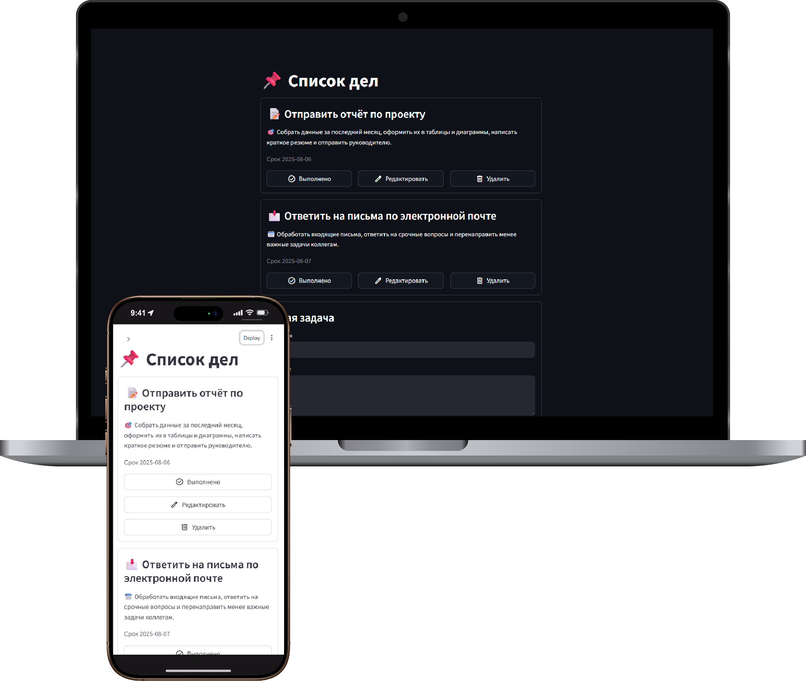

<h2 align="center"> 
🎯 Streamlit To-Do App
</h2> 

<div align="center">
  
</div>

<br/>

<div align="center">

[](https://forthebadge.com) &nbsp;
[](https://forthebadge.com)

</div>

---

## 🚀 About the Project

This is a simple yet extendable **To-Do List** application built with **Streamlit** and **SQLAlchemy**, supporting multilingual UI (English & Russian).  
Users can add, edit, mark as done, or delete tasks — all stored in a persistent SQL database.

Ideal for learning:
- Streamlit UI and interaction patterns
- SQLAlchemy integration with Streamlit
- Dynamic i18n (interface translation)

---

## 🛠 Built With

- **Streamlit** – Fast and intuitive web app framework for Python  
- **SQLAlchemy** – Python SQL toolkit and ORM  
- **Python 3.10+**  
- **SQLite** or any other SQL-compatible DB via Streamlit's SQL connection

---

## ✨ Features

- 🌍 **Multilingual Interface** — Switch between English and Russian  
- 🗃️ **SQL Backend** — Todos are stored and updated in real DB  
- 📋 **CRUD Functionality** — Create, Read, Update, Delete tasks  
- 💾 **Session State** — Efficient UI updates without unnecessary reruns  
- 🎯 **Expandable Codebase** — Easy to add features like tagging, sorting, etc.

---

## ⚡ Getting Started

### 1️⃣ Clone the repository

```bash
git clone https://github.com/dv0retsky/todo-app.git
```

### 2️⃣ Navigate to project folder

```bash
cd todo-app
```

3️⃣ Create virtual environment (optional but recommended)

```bash
python -m venv venv
source venv/bin/activate  # on Windows: venv\\Scripts\\activate
```

4️⃣ Run the app

```bash
streamlit run streamlit_app.py
```

## 🖋 Usage Instructions
1. App will prompt you to create the SQL table via sidebar (first run only).
2.  Use the form at the bottom to add new todos.
3. Click Edit, Delete, or Done buttons on cards.
4. Use sidebar language switch to toggle interface.

## 🧩 Customization
- Want more languages? Just add them to the translations dictionary.
- Need other features like priority, filtering, or user accounts? The codebase is modular and ready for upgrades.

---

<div align="center"> Made with ❤️ by <b>dv0retsky</b> </div>
